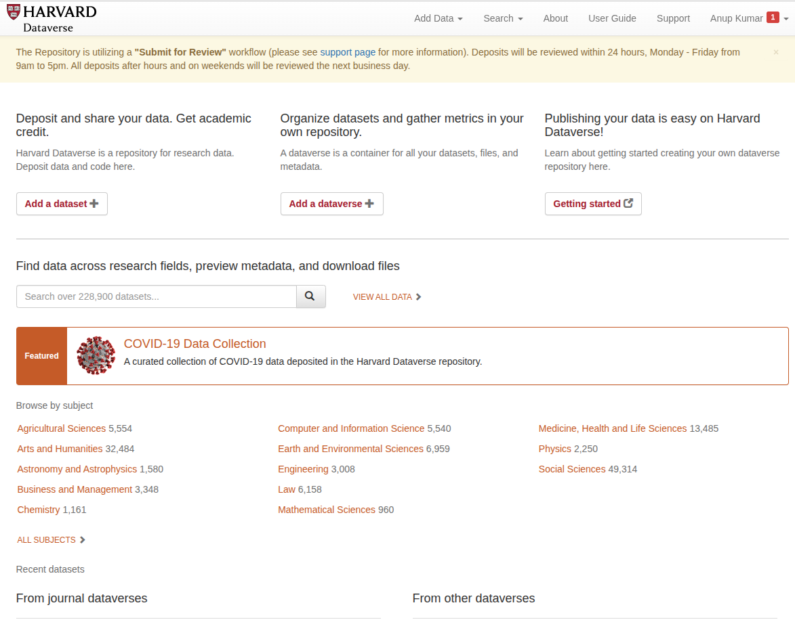
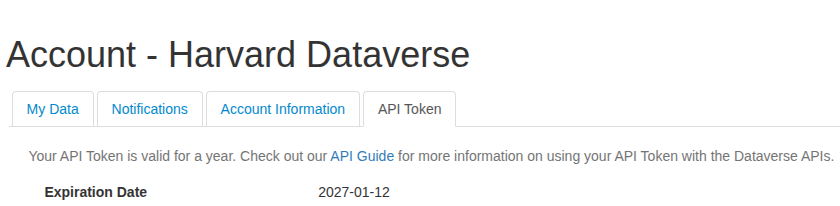

# Integration of Dataverse with Galaxy

Research data often lives in repositories like Dataverse, while analysis happens elsewhere—causing teams into a tedious loop of downloading, re-uploading, and losing context along the way. Integrating Dataverse into Galaxy closes that gap by bringing repository-hosted datasets directly into the Galaxy workspace, where they can be analyzed with reproducible tools and workflows. The result is a stremlined “data-to-results-to-publication” path: easier dataset discovery and reuse, fewer manual steps of data discovery, and better preservation of metadata and provenance collectively leading to findable, interpretable, and ready to share results back with the community.

    

> **Note:** The Dataverse has been integrated as part of the **Galaxy v25.1** release.

## Step-by-step: How to import Dataverse repositories into Galaxy

### 1) Create an account a Dataverse

Create a login of a Dataverse. For example, [**Harvard Dataverse**](https://dataverse.harvard.edu/). This provides an API access to the dataverse using an API token.

    

### 2) 

## Acknowledgements

## Resources

- 

